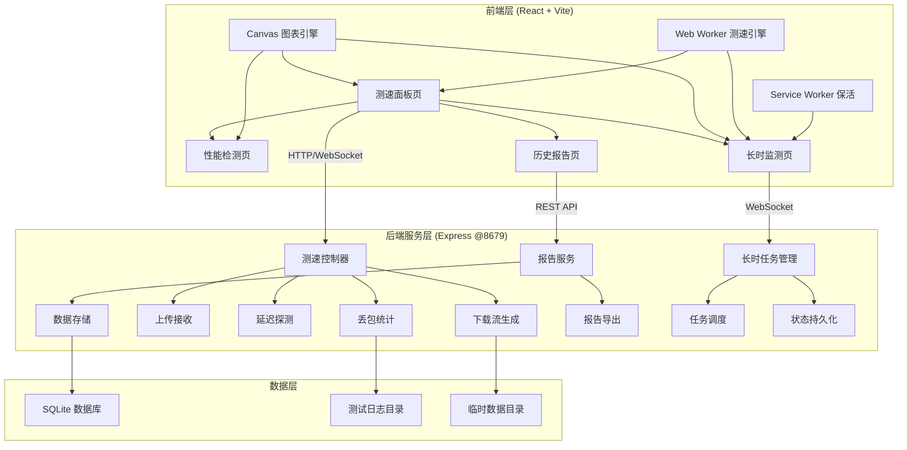
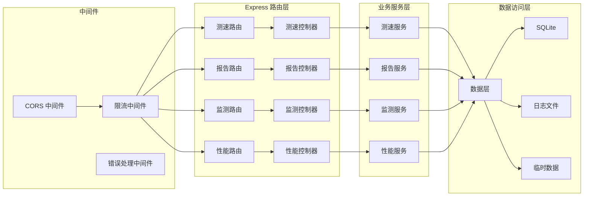
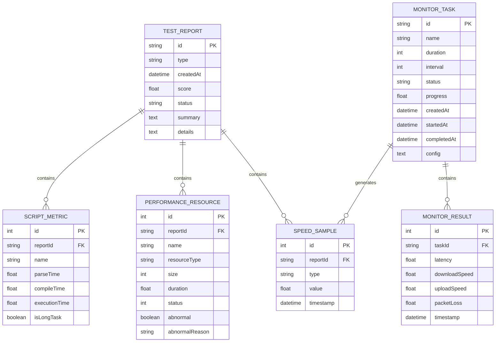

## 1. 架构设计



## 2. 技术说明

- **前端**：React@18 + TypeScript + Tailwind CSS@3 + Vite
- **图表**：Canvas 2D 自绘制（轻量无第三方图表库依赖，避免体积膨胀）
- **后端**：Express@4 + TypeScript，运行于 8679 端口
- **数据库**：SQLite（better-sqlite3），数据文件存于项目 `data/speedradar.db`
- **日志存储**：测试日志存放于 `data/logs/`，临时数据存放于 `data/temp/`
- **通信**：测速数据通过 WebSocket 实时推送，报告管理通过 REST API
- **保活机制**：Web Worker 执行测速运算 + Service Worker 心跳保活
- **限流策略**：后端令牌桶限流，前端指数退避重试

## 3. 路由定义

| 路由 | 用途 |
|------|------|
| `/` | 测速面板页 - 网络测速仪表盘 |
| `/performance` | 性能检测页 - 前端性能分析 |
| `/reports` | 历史报告页 - 测试记录与对比 |
| `/monitor` | 长时监测页 - 长时任务管理 |

## 4. API 定义

### 4.1 测速 API

```typescript
interface SpeedTestRequest {
  type: "download" | "upload" | "latency" | "packet-loss";
  duration?: number;
  packetSize?: number;
  targetCount?: number;
}

interface SpeedTestResponse {
  testId: string;
  type: string;
  startTime: number;
  endTime: number;
  results: {
    downloadSpeed?: number;
    uploadSpeed?: number;
    latency?: {
      min: number;
      avg: number;
      max: number;
      jitter: number;
    };
    packetLoss?: number;
  };
  score: number;
  samples: Array<{ time: number; value: number }>;
}

interface SpeedSample {
  timestamp: number;
  value: number;
  type: "download" | "upload" | "latency" | "packet-loss";
}
```

### 4.2 报告 API

```typescript
interface TestReport {
  id: string;
  type: "speed" | "performance" | "monitor";
  createdAt: string;
  score: number;
  summary: {
    downloadSpeed?: number;
    uploadSpeed?: number;
    latency?: number;
    packetLoss?: number;
    fcp?: number;
    lcp?: number;
    cls?: number;
  };
  details: Record<string, unknown>;
  status: "completed" | "failed" | "running";
}

interface CompareRequest {
  reportIds: string[];
}

interface ExportRequest {
  reportId: string;
  format: "json" | "csv";
}
```

### 4.3 长时监测 API

```typescript
interface MonitorTask {
  id: string;
  name: string;
  config: {
    duration: number;
    interval: number;
    targets: string[];
    testTypes: Array<"latency" | "download" | "upload">;
  };
  status: "running" | "paused" | "completed" | "failed";
  progress: number;
  createdAt: string;
  startedAt?: string;
  completedAt?: string;
  results?: Array<{
    timestamp: number;
    latency?: number;
    downloadSpeed?: number;
    uploadSpeed?: number;
  }>;
}

interface MonitorTaskCreate {
  name: string;
  duration: number;
  interval: number;
  targets: string[];
  testTypes: Array<"latency" | "download" | "upload">;
}
```

### 4.4 性能检测 API

```typescript
interface PerformanceReport {
  id: string;
  url: string;
  timestamp: string;
  webVitals: {
    fcp: number;
    lcp: number;
    cls: number;
    ttfb?: number;
    fid?: number;
  };
  resources: Array<{
    name: string;
    type: string;
    size: number;
    duration: number;
    status: number;
    abnormal: boolean;
    abnormalReason?: string;
  }>;
  scripts: Array<{
    name: string;
    parseTime: number;
    compileTime: number;
    executionTime: number;
    isLongTask: boolean;
  }>;
  longTasks: Array<{
    startTime: number;
    duration: number;
    name: string;
  }>;
}
```

### 4.5 REST 端点

| 方法 | 路径 | 用途 |
|------|------|------|
| POST | `/api/speed/test` | 启动测速 |
| GET | `/api/speed/download` | 下载测速数据流 |
| POST | `/api/speed/upload` | 上传测速数据 |
| GET | `/api/speed/ping` | 延迟探测 |
| GET | `/api/speed/packet-loss` | 丢包检测 |
| GET | `/api/reports` | 获取报告列表 |
| GET | `/api/reports/:id` | 获取单个报告 |
| POST | `/api/reports/compare` | 对比多个报告 |
| GET | `/api/reports/:id/export?format=json\|csv` | 导出报告 |
| DELETE | `/api/reports/:id` | 删除报告 |
| POST | `/api/monitor/tasks` | 创建监测任务 |
| GET | `/api/monitor/tasks` | 获取任务列表 |
| GET | `/api/monitor/tasks/:id` | 获取任务详情 |
| PUT | `/api/monitor/tasks/:id/pause` | 暂停任务 |
| PUT | `/api/monitor/tasks/:id/resume` | 恢复任务 |
| DELETE | `/api/monitor/tasks/:id` | 取消/删除任务 |
| POST | `/api/performance/analyze` | 提交性能分析数据 |

## 5. 服务端架构图



## 6. 数据模型

### 6.1 数据模型定义



### 6.2 数据定义语言

```sql
CREATE TABLE test_report (
    id TEXT PRIMARY KEY,
    type TEXT NOT NULL,
    createdAt TEXT NOT NULL,
    score REAL NOT NULL,
    status TEXT NOT NULL DEFAULT 'completed',
    summary TEXT NOT NULL DEFAULT '{}',
    details TEXT NOT NULL DEFAULT '{}'
);

CREATE TABLE speed_sample (
    id INTEGER PRIMARY KEY AUTOINCREMENT,
    reportId TEXT NOT NULL,
    type TEXT NOT NULL,
    value REAL NOT NULL,
    timestamp TEXT NOT NULL,
    FOREIGN KEY (reportId) REFERENCES test_report(id)
);

CREATE TABLE performance_resource (
    id INTEGER PRIMARY KEY AUTOINCREMENT,
    reportId TEXT NOT NULL,
    name TEXT NOT NULL,
    resourceType TEXT NOT NULL,
    size INTEGER NOT NULL DEFAULT 0,
    duration REAL NOT NULL DEFAULT 0,
    status INTEGER NOT NULL DEFAULT 200,
    abnormal INTEGER NOT NULL DEFAULT 0,
    abnormalReason TEXT,
    FOREIGN KEY (reportId) REFERENCES test_report(id)
);

CREATE TABLE script_metric (
    id INTEGER PRIMARY KEY AUTOINCREMENT,
    reportId TEXT NOT NULL,
    name TEXT NOT NULL,
    parseTime REAL NOT NULL DEFAULT 0,
    compileTime REAL NOT NULL DEFAULT 0,
    executionTime REAL NOT NULL DEFAULT 0,
    isLongTask INTEGER NOT NULL DEFAULT 0,
    FOREIGN KEY (reportId) REFERENCES test_report(id)
);

CREATE TABLE monitor_task (
    id TEXT PRIMARY KEY,
    name TEXT NOT NULL,
    duration INTEGER NOT NULL,
    interval INTEGER NOT NULL,
    status TEXT NOT NULL DEFAULT 'running',
    progress REAL NOT NULL DEFAULT 0,
    createdAt TEXT NOT NULL,
    startedAt TEXT,
    completedAt TEXT,
    config TEXT NOT NULL DEFAULT '{}'
);

CREATE TABLE monitor_result (
    id INTEGER PRIMARY KEY AUTOINCREMENT,
    taskId TEXT NOT NULL,
    latency REAL,
    downloadSpeed REAL,
    uploadSpeed REAL,
    packetLoss REAL,
    timestamp TEXT NOT NULL,
    FOREIGN KEY (taskId) REFERENCES monitor_task(id)
);

CREATE INDEX idx_report_type ON test_report(type);
CREATE INDEX idx_report_created ON test_report(createdAt);
CREATE INDEX idx_sample_report ON speed_sample(reportId);
CREATE INDEX idx_resource_report ON performance_resource(reportId);
CREATE INDEX idx_script_report ON script_metric(reportId);
CREATE INDEX idx_task_status ON monitor_task(status);
CREATE INDEX idx_monitor_task ON monitor_result(taskId);
```
